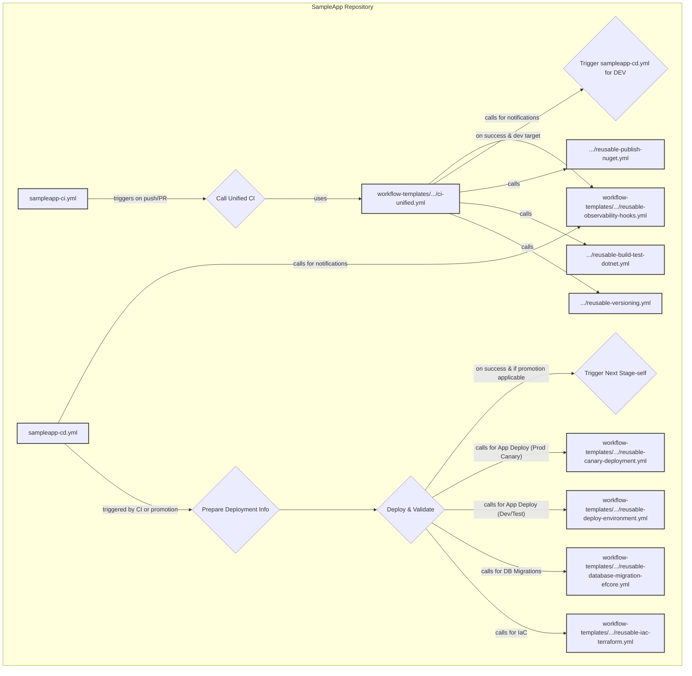

```mermaid
graph TD
    subgraph SampleApp Repository
        A[sampleapp-ci.yml] -- triggers on push/PR --> B{Call Unified CI};
        B -- uses --> C[workflow-templates/.../ci-unified.yml];
        C -- calls --> C1[.../reusable-versioning.yml];
        C -- calls --> C2[.../reusable-build-test-dotnet.yml];
        C -- calls --> C3[.../reusable-publish-nuget.yml];
        C -- on success & dev target --> D{Trigger sampleapp-cd.yml for DEV};

        E[sampleapp-cd.yml] -- triggered by CI or promotion --> F{Prepare Deployment Info};
        F --> G{Deploy & Validate};
        G -- calls for IaC --> H[workflow-templates/.../reusable-iac-terraform.yml];
        G -- calls for DB Migrations --> I[workflow-templates/.../reusable-database-migration-efcore.yml];
        G -- calls for App Deploy (Dev/Test) --> J[workflow-templates/.../reusable-deploy-environment.yml];
        G -- calls for App Deploy (Prod Canary) --> K[workflow-templates/.../reusable-canary-deployment.yml];
        G -- on success & if promotion applicable --> L{Trigger Next Stage-self};
        E -- calls for notifications --> M[workflow-templates/.../reusable-observability-hooks.yml];
        C -- calls for notifications --> M;
    end

    style A fill:#lightgrey,stroke:#333,stroke-width:2px
    style E fill:#lightgrey,stroke:#333,stroke-width:2px
    style C fill:#lightblue,stroke:#333,stroke-width:2px
    style H fill:#lightblue,stroke:#333,stroke-width:2px
    style I fill:#lightblue,stroke:#333,stroke-width:2px
    style J fill:#lightblue,stroke:#333,stroke-width:2px
    style K fill:#lightblue,stroke:#333,stroke-width:2px
    style M fill:#lightblue,stroke:#333,stroke-width:2px
    style C1 fill:#lightblue,stroke:#333,stroke-width:2px
    style C2 fill:#lightblue,stroke:#333,stroke-width:2px
    style C3 fill:#lightblue,stroke:#333,stroke-width:2px

```